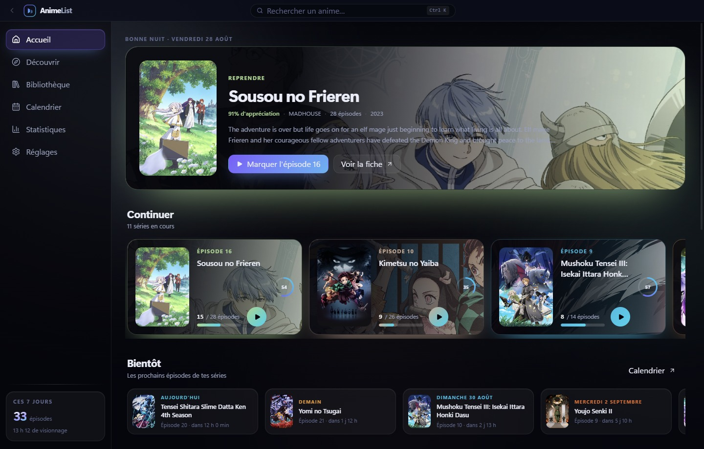
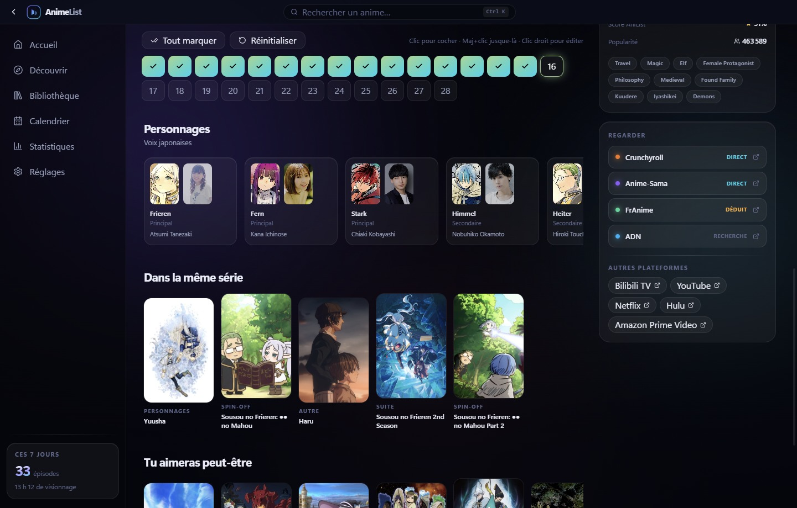
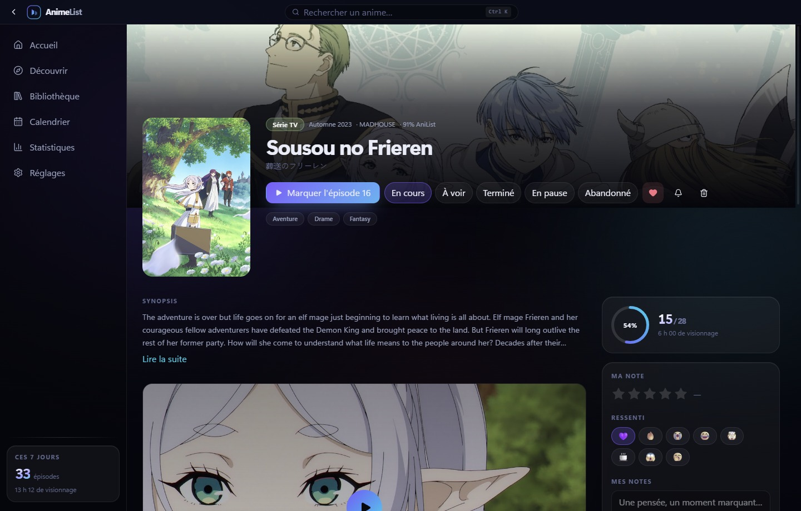
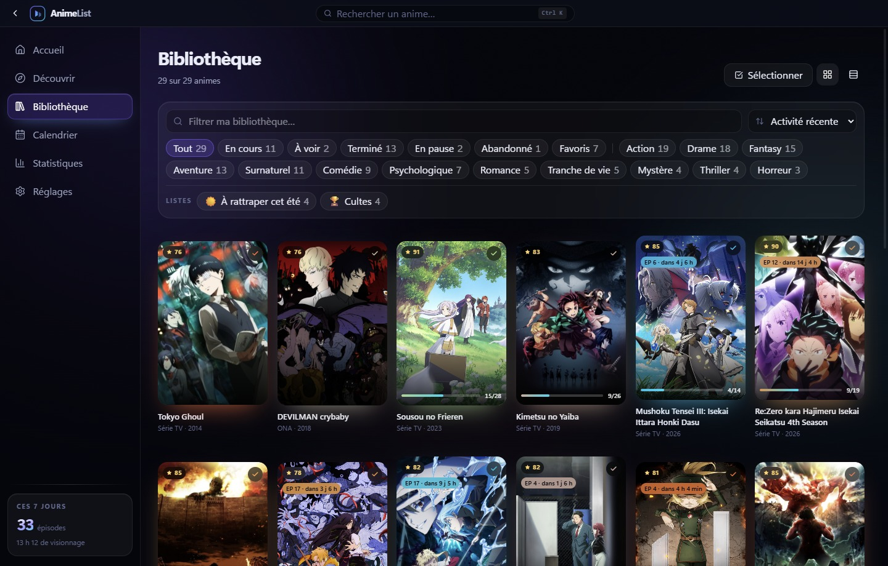
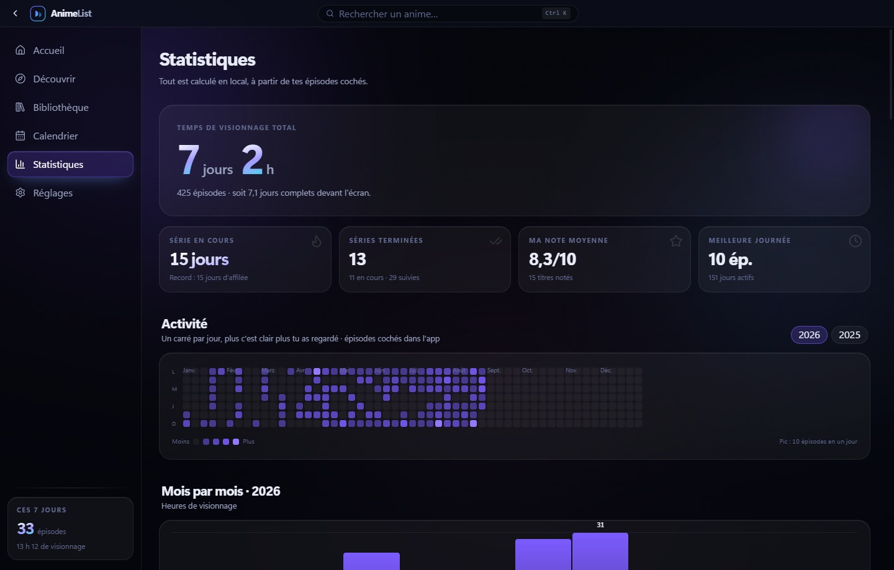
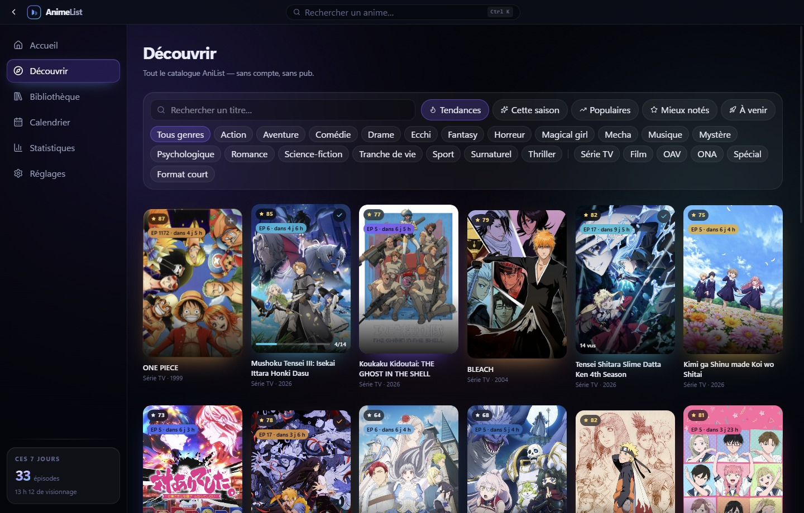
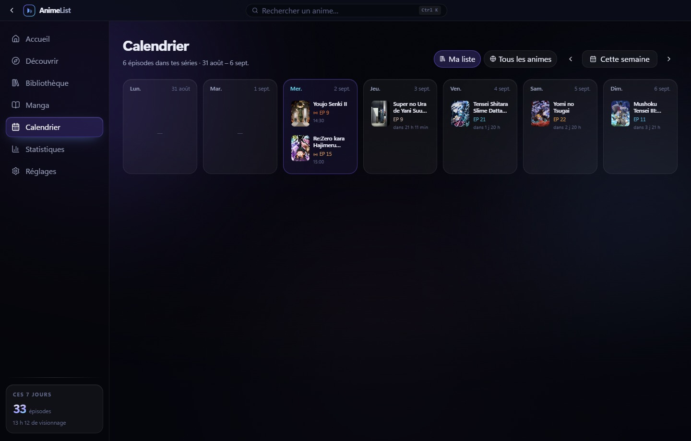
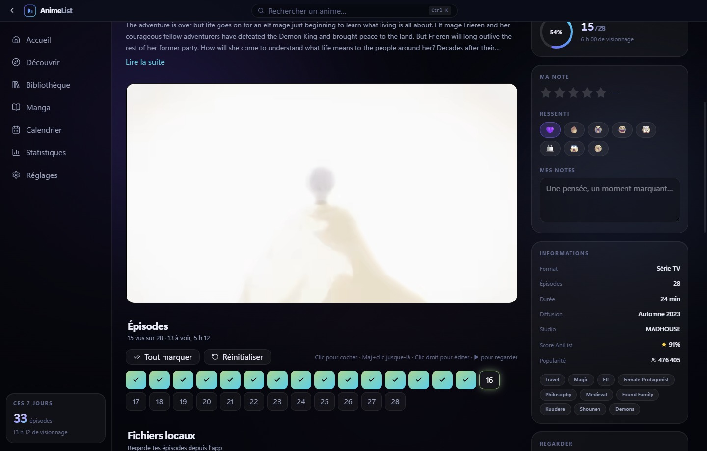
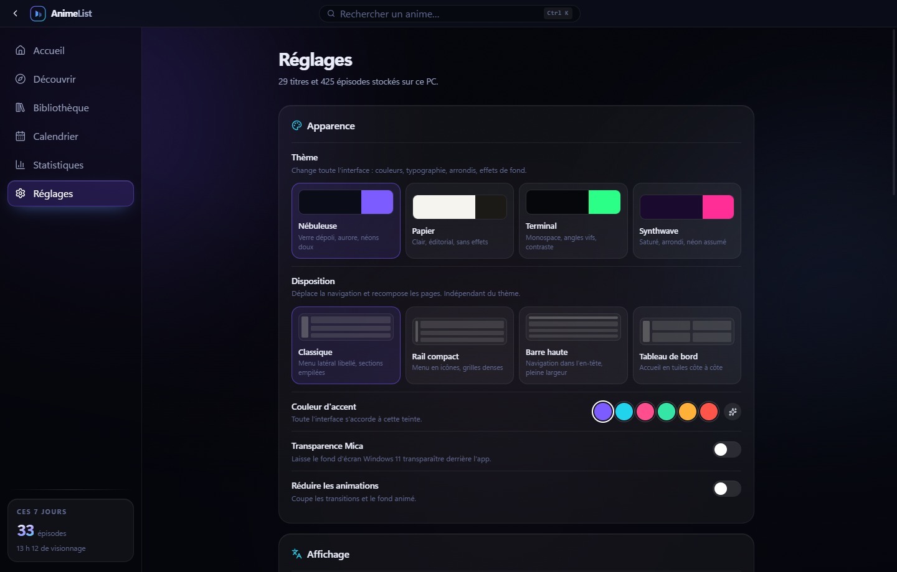

<div align="center">

# AnimeList

**Suivi d'animes local-first pour Windows 11.**
Pas de compte, pas de serveur, pas de pub, pas d'analytics —
toute ta bibliothèque vit dans un fichier sur ton PC.


Auteur : **Zaidal**

</div>

Inspiré des fonctionnalités d'*OpenTV: TV & Movie Tracker*, transposées à l'anime.



<sub>Les captures sont générées par `npm run screenshots` sur une bibliothèque de démonstration :
les fiches viennent du catalogue public AniList, la progression et les dates sont inventées. La
vraie bibliothèque n'est jamais lue — ce dépôt est public et un historique de visionnage est
personnel.</sub>

<table>
<tr>
<td width="50%"><a href="docs/screenshots/episodes.jpg"></a><br><sub><b>Grille d'épisodes.</b> Clic pour cocher, <code>Maj+clic</code> jusque-là, clic droit pour éditer date, durée, ressenti et note. À droite, les liens de visionnage indiquent s'ils mènent à l'anime ou à une recherche.</sub></td>
<td width="50%"><a href="docs/screenshots/fiche.jpg"></a><br><sub><b>Fiche.</b> Bannière, statut, progression, note par demi-point, ressentis, bande-annonce, casting, relations et recommandations.</sub></td>
</tr>
<tr>
<td><a href="docs/screenshots/bibliotheque.jpg"></a><br><sub><b>Bibliothèque.</b> Cinq statuts, favoris, filtres par genre et format, listes personnalisées, mode sélection et actions groupées.</sub></td>
<td><a href="docs/screenshots/statistiques.jpg"></a><br><sub><b>Statistiques.</b> Temps total, séries de jours, heatmap annuelle, graphique mensuel, top genres et studios, badges.</sub></td>
</tr>
<tr>
<td><a href="docs/screenshots/decouvrir.jpg"></a><br><sub><b>Découvrir.</b> Tendances, saison en cours, populaires, mieux notés, à venir, recherche instantanée.</sub></td>
<td><a href="docs/screenshots/calendrier.jpg"></a><br><sub><b>Calendrier.</b> Les prochains épisodes de tes séries, semaine par semaine, ou tout ce qui sort.</sub></td>
</tr>
</table>

<table>
<tr>
<td width="50%"><a href="docs/screenshots/bande-annonce.jpg"></a><br><sub><b>Bande-annonce.</b> Elle se lance à la place de la vignette, dans la page. Pas de fenêtre, pas d'habillage YouTube.</sub></td>
<td width="50%"><a href="docs/screenshots/reglages.jpg"></a><br><sub><b>Réglages.</b> Quatre thèmes et quatre dispositions, combinables librement.</sub></td>
</tr>
</table>

## Ce que ça fait

- **Suivi épisode par épisode** — grille cliquable, `Maj+clic` pour cocher jusqu'à un épisode,
  passage automatique de « À voir » → « En cours » → « Terminé »
- **Bibliothèque** — 5 statuts + favoris, filtres par genre/format, tri, vues grille et liste
- **Notes & ressentis** — étoiles par demi-point (0–10), réactions emoji, notes libres, au
  niveau de la série **et de chaque épisode** (clic droit sur une vignette)
- **Revisionnage** — « Revoir » ouvre un nouveau passage : la grille se vide, l'historique
  précédent reste et continue de compter dans le temps total. Chaque visionnage garde sa
  propre date, sa durée, ses ressentis et sa note
- **Historique corrigeable** — modifier la date ou la durée d'un épisode vu, en supprimer un.
  Une date corrigée à la main rejoint les statistiques par jour, dont les imports sont exclus
- **Découverte** — tendances, saison en cours, populaires, mieux notés, à venir, recherche
  instantanée, casting, relations, recommandations
- **Bandes-annonces dans la page**, à la place de la vignette, avec un bouton pour agrandir dans
  une fenêtre. Voir la note technique plus bas : le lecteur intégré de YouTube refuse de démarrer
  sur une page `file://`, ce qui demande un détour
- **Calendrier** — grille hebdomadaire des prochains épisodes de tes séries
- **Où regarder** — chaque fiche propose Crunchyroll, Anime-Sama et ADN, en indiquant
  si le lien mène à l'anime lui-même ou à une recherche. Les slugs Anime-Sama étant
  indevinables (`Kaiju No. 8` → `kaiju-n8`), ils sont lus dans le catalogue du site puis
  l'URL de saison est vérifiée avant d'être proposée : 87 % de liens directs mesurés sur
  une bibliothèque de 85 titres, le reste bascule sur la recherche
- **Statistiques** — temps total, séries de jours (streaks), heatmap annuelle, graphique
  mensuel, top genres/studios, 12 badges, panthéon des mieux notées
- **Notifications Windows** quand un épisode d'une série suivie sort
- **Import MyAnimeList** (`animelist_*.xml` ou `.xml.gz`) avec reconstruction de l'historique
- **Import TV Time / OpenTV** — choisis le dossier de l'export, les séries suivies sont
  retrouvées sur AniList et leurs épisodes répartis sur les bonnes saisons. TheTVDB modélise
  un long anime comme une série à saisons là où AniList le découpe en une entrée par cour,
  donc les épisodes sont versés le long d'une chaîne de suites avec débordement. Les séries
  introuvables sont listées avec un champ pour saisir un id AniList ; les corrections sont
  conservées et rejouées
- **Export / restauration** JSON, et fonctionnement hors-ligne grâce au cache disque

## Démarrer

```bash
npm install      # télécharge aussi le binaire Electron (voir la note Node ci-dessous)
npm run dev      # développement, HMR sur le renderer
npm start        # lance la version buildée
npm run build    # typecheck + bundles de production dans out/
npm run dist     # installeur Windows (NSIS) dans release/
npm run release  # build + publication sur les Releases GitHub (voir plus bas)
npm run screenshots  # régénère docs/screenshots/ (voir plus bas)
```

Développé et vérifié sur **Node 24.18.0 / npm 11.16.0**.

L'icône (`build/icon.ico` + `icon.png`) est générée par `python scripts/make-icon.py` — même
géométrie que le logo affiché dans l'app, à relancer si tu changes la marque.

> **Pourquoi `scripts/install-electron.mjs`.** Le binaire Electron (~110 Mo) n'est pas dans le
> paquet npm : il est téléchargé par un script d'installation. Ce script échoue dans deux cas
> courants, et l'app refuse alors de démarrer avec `Error: Electron uninstall` :
>
> 1. sur Node < 20.19, le postinstall d'`electron@43` fait un `require()` sur `@electron/get`
>    devenu ESM-only → `ERR_REQUIRE_ESM` ;
> 2. sur npm ≥ 11, les scripts d'installation des dépendances tierces sont bloqués par défaut
>    (`npm approve-scripts`), donc celui d'Electron ne s'exécute pas du tout.
>
> Le script maison est branché en `postinstall` de *ce* paquet — donc toujours autorisé — et
> refait le travail via `import()` dynamique. Il ne fait rien si le binaire est déjà là.
>
> Les autres scripts bloqués par npm 11 (`esbuild`, `electron-winstaller`) n'ont pas d'impact :
> esbuild passe par ses paquets de binaires optionnels, et `electron-winstaller` ne sert qu'à la
> cible Squirrel, alors qu'on package en NSIS.

> **Pourquoi la bande-annonce passe par un serveur local.** Le lecteur intégré de YouTube refuse
> de démarrer quand la page qui l'intègre n'envoie pas d'en-tête `Referer` : il répond
> *erreur 153*. Le renderer packagé est chargé depuis `file://`, qui n'en envoie aucun. Mesuré et
> non supposé : charger l'URL d'intégration comme page principale échoue pareil, elle n'envoie pas
> de referrer non plus.
>
> Le lecteur est donc enveloppé dans une page servie depuis `http://127.0.0.1:<port>`, et c'est
> *elle* que la fiche met dans une iframe. Le navigateur envoie alors un `Referer` véridique pour
> une page qui intègre réellement la vidéo, et le lecteur démarre — dans la fiche, sans fenêtre
> séparée. Rien n'est falsifié : l'autre solution, forcer un `httpReferrer` de `youtube.com`,
> consisterait à revendiquer une origine qui n'est pas la nôtre.
>
> Le serveur écoute sur `127.0.0.1` uniquement, sur un port éphémère, derrière un chemin
> aléatoire, ne sert qu'un seul type de page et rien depuis le disque. L'identifiant vidéo est
> validé contre l'alphabet de YouTube avant toute interpolation. La page embarque sa propre CSP :
> elle peut encadrer YouTube et rien d'autre, et n'exécute aucun script.
>
> Deux ajustements côté app ont été nécessaires, tous deux vérifiés par capture. La CSP autorise
> `frame-src http://127.0.0.1:*`. Et surtout, son injection est désormais **limitée au document
> principal** : elle était appliquée à *toutes* les réponses, y compris celles de YouTube, si bien
> que `script-src 'self'` bloquait les propres scripts du lecteur. C'est ce qui rendait la
> première tentative entièrement noire — imposer notre CSP à un tiers n'avait de toute façon aucun
> sens.
>
> Certaines chaînes désactivent l'intégration de leurs vidéos. Le lecteur affiche alors sa propre
> erreur avec un lien « regarder sur YouTube », qui ouvre le vrai navigateur. Sur les 48 bandes-
> annonces des animes les plus populaires d'AniList, l'intégration était autorisée dans 48 cas.

> **Audit.** `npm audit` remonte des alertes « high » sur l'arbre d'`electron-builder`
> (`brace-expansion` → `minimatch` → `glob`…). Ce sont des dépendances de développement utilisées
> au packaging uniquement ; rien de tout ça n'est embarqué dans l'application distribuée.

## Raccourcis

| Touche | Action |
|---|---|
| `Ctrl+K` | Palette de recherche (bibliothèque + AniList + navigation) |
| `↑` `↓` `⏎` | Naviguer / ouvrir dans la palette |
| `Alt+←` | Retour |
| `Maj+clic` sur un épisode | Cocher tous les épisodes jusque-là |
| Clic droit sur un épisode | Éditer ses visionnages : date, durée, ressenti, note |

## Où sont mes données

Deux fichiers, chacun écrit de façon atomique avec une copie de secours :

```
%APPDATA%\animelist\animelist.json              # bibliothèque, préférences, listes
%APPDATA%\animelist\animelist-history.jsonl     # un épisode vu par ligne
%APPDATA%\animelist\animelist.json.bak          # dernier état valide
%APPDATA%\animelist\anilist-cache.json          # cache réseau (supprimable sans risque)
```

L'historique est séparé parce que les deux moitiés changent à des rythmes très différents :
cocher un épisode ajoute une ligne au journal au lieu de re-sérialiser des milliers
d'entrées. Seules les modifications et suppressions forcent une réécriture complète.

Réglages → *Mes données* → **Ouvrir** te dépose directement dedans. L'export produit
exactement le même format que le fichier principal : c'est ta sauvegarde.

## Architecture

```
src/
  main/        process Electron : store JSON atomique, client AniList, IPC, notifications
  preload/     pont contextBridge typé (window.api)
  renderer/    React 19 + Tailwind v4 + Motion
  shared/      types partagés main ↔ renderer
```

- **Une seule dépendance runtime**, `electron-updater`. Tout le reste est bundlé ; aucun module
  natif, donc aucun outil de compilation C++ requis et aucun problème d'ABI au packaging. Le
  compromis est assumé : faire les mises à jour à la main voudrait dire télécharger un binaire,
  vérifier sa signature et lancer l'installeur NSIS soi-même — se tromper là, c'est se livrer un
  logiciel malveillant à soi-même.
- **Le main détient les données.** Le renderer mute via IPC, le main renvoie un événement
  `store:change`, le renderer resynchronise. Les coches d'épisodes sont optimistes pour rester
  instantanées.
- **Données AniList** via l'API GraphQL publique (sans clé), appelée depuis le main : pas de
  CORS, une file d'attente qui respecte la limite de débit, et un cache disque qui sert de
  repli hors-ligne.
- **Sécurité** : `contextIsolation` activé, `nodeIntegration` désactivé, CSP stricte en
  production, navigation externe forcée vers le navigateur système.

## Design

Sombre, verre dépoli, aurore animée en fond, matériau **Mica** de Windows 11 (désactivable).
La couleur d'accent est configurable et se propage à toute l'UI, y compris les graphiques.

Les graphiques suivent une méthode explicite : chaque série encode une magnitude, donc chaque
graphique reste **mono-teinte** et laisse la longueur, la position ou la clarté porter la valeur.
La rampe de la heatmap est une rampe ordinale validée (teinte unique, clarté monotone, palier le
plus clair à ≥ 2:1 sur la surface du graphique), et les libellés portent des couleurs de texte,
jamais celle de la série.

Quatre **thèmes** et quatre **dispositions** (Classique, Rail, Barre haute, Tableau de bord) se
combinent librement depuis les Réglages. Un thème est une réécriture complète du jeu de
variables — couleurs, typographie, rayons, ombres, flou, effets de fond — pas seulement une
teinte.

| Thème | Monde |
|---|---|
| **Nébuleuse** | Verre dépoli, aurore animée, néons doux |
| **Papier** | Clair, éditorial, serif, sans effets |
| **Terminal** | Monospace, angles vifs, scanlines, fort contraste |
| **Synthwave** | Saturé, entièrement arrondi, néon assumé |

Un thème ne peut pas figer la couleur d'accent, puisqu'elle est réglable. Sur un fond clair cela
demande de la prudence : un accent vif peut tomber sous 3:1 comme couleur de texte. La règle
tenue partout est donc que l'accent teinte les fonds et les contours, et que le texte reste de
l'encre.

`PRODUCT.md` à la racine consigne la vérité produit — usagers, contraintes, principes — sans
aucune décision visuelle.

## Qualité

```bash
npm test           # 319 tests unitaires (Vitest)
npm run lint       # ESLint 10, typé, 0 erreur
npm run typecheck  # tsc sur les deux projets
npm run format     # Prettier
```

Ce qui est couvert par des tests : appariement et normalisation des titres, formatage,
lecture/écriture du store, migrations de schéma, ordonnanceur de requêtes, et toute la
chaîne d'import TV Time (lecture CSV, appariement, marche dans les suites, répartition
des épisodes, localisation des fichiers).

Deux mécanismes méritent d'être signalés :

- **Migrations de schéma versionnées** (`src/main/migrations.ts`). Le fichier de données porte
  un numéro de version ; à l'ouverture, les migrations manquantes sont appliquées après une
  sauvegarde horodatée. Un fichier écrit par une version *plus récente* passe en lecture seule
  plutôt que d'être réécrit par un build ancien.
- **File de requêtes à deux voies** (`src/main/queue.ts`). AniList tolère ~30 requêtes/minute.
  Les appels déclarent une voie : ce que l'utilisateur attend passe devant le travail de fond,
  et les requêtes identiques sont mutualisées plutôt que répétées.

## Feuille de route

- [x] Importeur TV Time / OpenTV intégré à l'app
- [x] Interface de revisionnage
- [x] Édition de l'historique (corriger une date, retirer un épisode)
- [x] Notes et ressentis par épisode
- [ ] Listes personnalisées et actions groupées
- [x] Notifications par série, avec délai configurable
- [x] Accessibilité et découpage du bundle
- [x] Écriture incrémentale du store
- [x] Mise à jour automatique
- [x] Captures d'écran générées (`npm run screenshots`, jeu de démo)

## Régénérer les captures

```bash
npm run screenshots           # écrit dans docs/screenshots/
npm run screenshots docs/tmp  # ou ailleurs
```

Le script construit une bibliothèque de démonstration, l'écrit dans un dossier de données
jetable, puis lance l'app dessus avec `--screenshots` : elle parcourt ses propres pages et
capture chacune via `webContents.capturePage()`. Une capture d'écran système ne conviendrait pas
— il faut naviguer, et seule l'app peut le faire — et elle embarquerait la barre des tâches.

Trois choix qui expliquent le résultat :

- **La vraie bibliothèque n'est jamais lue.** Le dossier de données est temporaire et supprimé
  après coup. Les fiches sont publiques, la progression est inventée.
- **L'historique est inventé par grappes, et va jusqu'à aujourd'hui.** Un étalement régulier
  donne une heatmap grise, une série de jours à zéro et « ces 7 jours : 0 épisode ». Les épisodes
  sont donc posés à rebours depuis un jour de fin, en séances de trois à cinq.
- **Le casting est fixe, sauf les séries en diffusion.** Celles-là sont demandées à AniList au
  moment du tir, sinon le calendrier serait vide. Deux captures successives ne sont donc pas
  strictement identiques.

Les images sont en JPEG et non en PNG : ce sont surtout des jaquettes, que PNG stocke mal — les
mêmes huit pages pesaient 8,7 Mo en PNG contre 1,7 Mo ici.

## Publier une mise à jour

```bash
# 1. incrémenter "version" dans package.json
# 2. exporter un jeton GitHub ayant le droit d'écrire les releases
export GH_TOKEN=...
npm run release
```

`electron-updater` ne lit pas la page de release : il lui faut le `latest.yml` que
`electron-builder` dépose à côté de l'installeur. Envoyer le `.exe` à la main ne suffit donc
pas — il faut passer par `npm run release`, ou joindre le `latest.yml` généré.

Côté application, le cycle est entièrement automatique : recherche au lancement puis toutes
les six heures, téléchargement seul dès qu'une version paraît, installation en silence à la
fermeture de l'app — `electron-updater` passe `/S` à l'installeur NSIS, aucun assistant
n'apparaît. Une notification annonce la version prête et propose le redémarrage immédiat, et le
réglage « Mise à jour automatique » ramène les trois étapes à des boutons.

Ce que l'app ne fait pas : se fermer d'elle-même pour installer. Remplacer une application en
cours d'usage se décide par celui qui l'utilise.

Une limite à connaître : l'application n'est **pas signée**. Windows SmartScreen avertit à la
première installation, celle faite à la main depuis le `.exe` téléchargé par un navigateur. La
mise à jour, elle, n'est pas concernée : le fichier arrive par Node sans marque de provenance,
donc sans contrôle de réputation.

## Licence

Projet personnel, non distribué. Les données d'anime proviennent de l'API publique
[AniList](https://anilist.co) et appartiennent à leurs auteurs respectifs.
